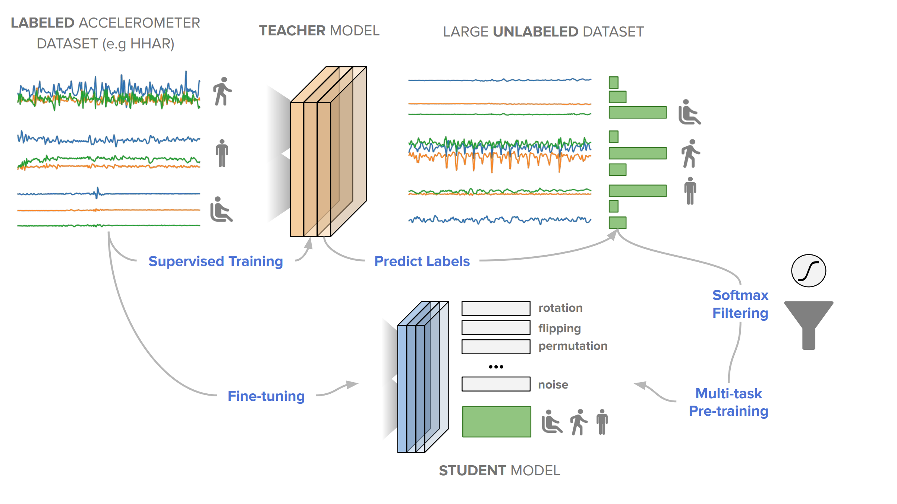

# SelfHAR - Improving Human Activity Recognition through Self-training with Unlabeled Data


<sub><sup>(Based on work of Tang, Chi Ian and Perez-Pozuelo, Ignacio and Spathis, Dimitris and Brage, Soren and Wareham, Nick and Mascolo, Cecilia)</sup></sub>


Machine learning and deep learning have shown great promise in mobile sensing applications, including Human Activity Recognition. However, the performance of such models in real-world settings largely depends on the availability of large datasets that captures diverse behaviors. Recently, studies in computer vision and natural language processing have shown that leveraging massive amounts of unlabeled data enables performance on par with state-of-the-art supervised models.

In this work, we present SelfHAR, a semi-supervised model that effectively learns to leverage unlabeled mobile sensing datasets to complement small labeled datasets. Our approach combines teacher-student self-training, which distills the knowledge of unlabeled and labeled datasets while allowing for data augmentation, and multi-task self-supervision, which learns robust signal-level representations by predicting distorted versions of the input.

More details can be found in our full paper published in IMWUT: https://doi.org/10.1145/3448112.

This repository complements our paper, providing a reference implementation of the method as described in the paper. Please contact the authors for enquiries regarding the code.

> Note: This repository is still under active development and breaking changes might be made in future commits and releases.

# Citation

If you find our paper useful, please consider citing our work:

DOI: https://doi.org/10.1145/3448112
```
@article{tang2021selfhar,
  title={SelfHAR: Improving Human Activity Recognition through Self-training with Unlabeled Data},
  author={Tang, Chi Ian and Perez-Pozuelo, Ignacio and Spathis, Dimitris and Brage, Soren and Wareham, Nick and Mascolo, Cecilia},
  journal={Proceedings of the ACM on Interactive, Mobile, Wearable and Ubiquitous Technologies},
  volume={5},
  number={1},
  pages={1--30},
  year={2021},
  publisher={ACM New York, NY, USA}
}
```

# Setting Up
The repository has been tested on Python 3.6.8 and external Python libraries used in this repository are recorded in [requirements.txt](./requirements.txt)

To install the dependencies, please run `pip install -r requirements.txt`.

# Running the Code

The main entry points of the repository are `run_self_har.py` and `run_datasets.py`.

`run_datasets.py` provides functionalities on downloading and pre-processing HAR datasets to be used for training. Currently, it supports the [MotionSense](https://github.com/mmalekzadeh/motion-sense) dataset and the [HHAR](http://archive.ics.uci.edu/ml/datasets/heterogeneity+activity+recognition) dataset. Please make sure that you have read and agree to the terms and conditions set out by the authors/data collectors of these datasets before running the script.

`run_self_har.py` implements the training, fine-tuning and evaluation of HAR models following the SelfHAR and related pipelines. The training pipeline is controlled using a JSON configuration file passed via command line argument `--config`. Sample configuration files are included in the [sample_configs](./sample_configs/) folder, which include configurations for the SelfHAR, Transformation Discrimination Only, Self-Training Only and Fully-supervised pipelines. Please refer to the [README.md](./sample_configs/README.md) in the folder for creating a customised training pipeline.

## Demo: Training a model for MotionSense following the SelfHAR pipeline

Please run the following commands to:
1. Download the [MotionSense](https://github.com/mmalekzadeh/motion-sense) dataset and the [HHAR](http://archive.ics.uci.edu/ml/datasets/heterogeneity+activity+recognition) dataset, and
2. Train a HAR model following the SelfHAR pipeline, using HHAR as the unlabelled dataset, and fine-tuned and trained on the MotionSense dataset.

```
python run_datasets.py --working_directory test_run --mode download_and_process --dataset all
python run_self_har.py --working_directory test_run --config sample_configs/self_har.json --labelled_dataset_path test_run/processed_datasets/motionsense_processed.pkl --unlabelled_dataset_path test_run/processed_datasets/hhar_processed.pkl --window_size 400 --max_unlabelled_windows 40000
```


# Results


We evaluated SelfHAR on various HAR datasets and showed state-of-the-art performance over supervised and previous semi-supervised approaches, with up to 12% increase in F1 score using the same number of model parameters at inference. Furthermore, SelfHAR is data-efficient, reaching similar performance using up to 10 times less labeled data compared to supervised approaches. Our work not only achieves state-of-the-art performance in a diverse set of HAR datasets, but also sheds light on how pre-training tasks may affect downstream performance.

# Code Organisation

A brief description of each Python script is provided below:

| File | Description |
| --- | --- |
| `run_datasets.py` | Python commonad line script which provides functionalities on  downloading and pre-processing HAR datasets to be used for training. |
| `run_self_har.py` | Python commonad line script which implements the training, fine-tuning and evaluation of HAR models following the SelfHAR and related pipelines. |
| `data_pre_processing.py` | Various functions for pre-processing data and preparing it for training and evaluation. |
| `raw_data_processing.py` | Functionalities for parsing datasets from the original source into a Python object for further processing. |
| `self_har_models.py` | The specifications and manupulation of different models for training. |
| `self_har_trainers.py` | Wrappers for training Tensorflow models. |
| `self_har_utilities.py` | Functionalities for model evaluation and data-processing. |
| `transformations.py` | Different functions for generating alternative views of sensor signals. |

# License
The current version of this repository is released under the GNU General Public License v3.0 unless otherwise stated. The author of the repository retains his respective rights. The published paper is governed by a separate license and the authors retain their respective rights.

# Disclaimers
Disclaimer of Warranty.
THERE IS NO WARRANTY FOR THE PROGRAM, TO THE EXTENT PERMITTED BY APPLICABLE LAW.  EXCEPT WHEN OTHERWISE STATED IN WRITING THE COPYRIGHT HOLDERS AND/OR OTHER PARTIES PROVIDE THE PROGRAM "AS IS" WITHOUT WARRANTY OF ANY KIND, EITHER EXPRESSED OR IMPLIED, INCLUDING, BUT NOT LIMITED TO, THE IMPLIED WARRANTIES OF MERCHANTABILITY AND FITNESS FOR A PARTICULAR PURPOSE.  THE ENTIRE RISK AS TO THE QUALITY AND PERFORMANCE OF THE PROGRAM IS WITH YOU.  SHOULD THE PROGRAM PROVE DEFECTIVE, YOU ASSUME THE COST OF ALL NECESSARY SERVICING, REPAIR OR CORRECTION.

Limitation of Liability.
IN NO EVENT UNLESS REQUIRED BY APPLICABLE LAW OR AGREED TO IN WRITING WILL ANY COPYRIGHT HOLDER, OR ANY OTHER PARTY WHO MODIFIES AND/OR CONVEYS THE PROGRAM AS PERMITTED ABOVE, BE LIABLE TO YOU FOR DAMAGES, INCLUDING ANY GENERAL, SPECIAL, INCIDENTAL OR CONSEQUENTIAL DAMAGES ARISING OUT OF THE USE OR INABILITY TO USE THE PROGRAM (INCLUDING BUT NOT LIMITED TO LOSS OF DATA OR DATA BEING RENDERED INACCURATE OR LOSSES SUSTAINED BY YOU OR THIRD PARTIES OR A FAILURE OF THE PROGRAM TO OPERATE WITH ANY OTHER PROGRAMS), EVEN IF SUCH HOLDER OR OTHER PARTY HAS BEEN ADVISED OF THE POSSIBILITY OF SUCH DAMAGES.

# Other works used in this project
This work made use of the MotionSense dataset available at https://github.com/mmalekzadeh/motion-sense, and the HHAR dataset available at http://archive.ics.uci.edu/ml/datasets/heterogeneity+activity+recognition.

The transformation functions for the time-series in this repository is based on Um et al.'s work at https://github.com/terryum/Data-Augmentation-For-Wearable-Sensor-Data.

# Copyright

Copyright (C) 2021 Chi Ian Tang
