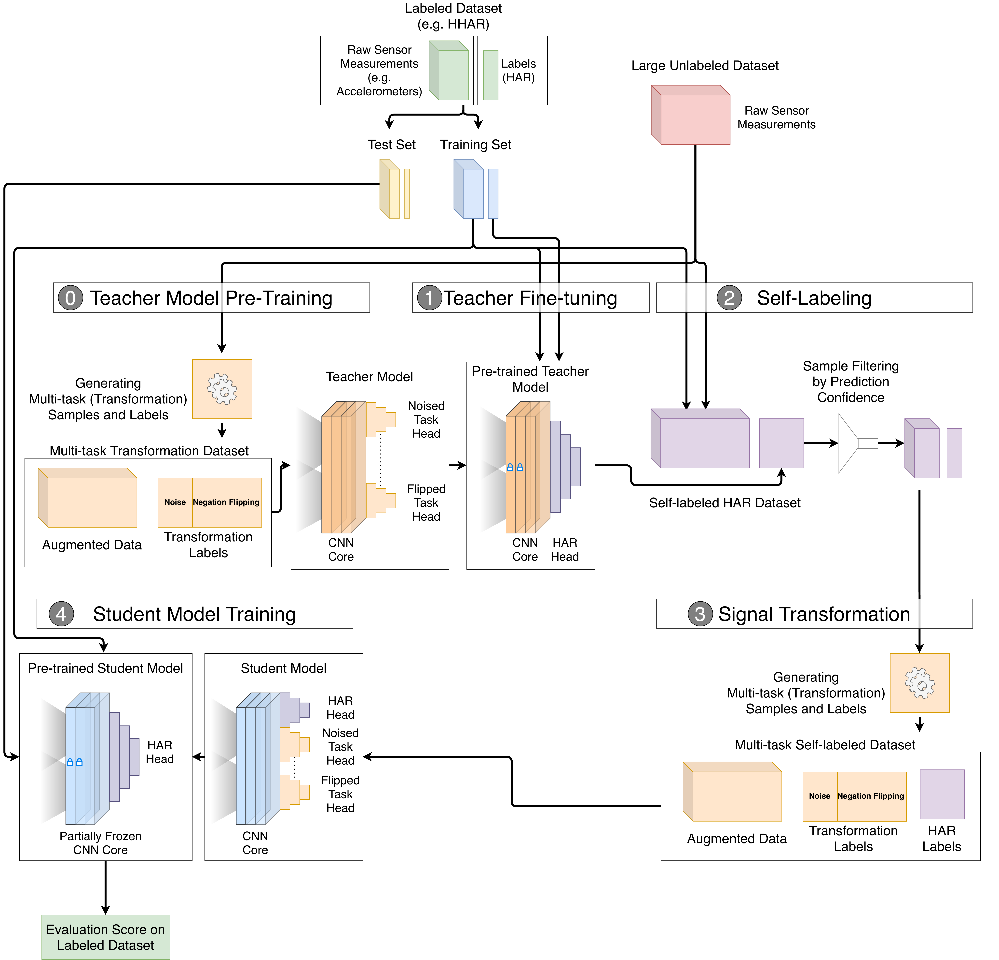

# Specifying a Training Pipeline

The file contains the instructions for specifying a customised training pipeline.

Each file is organised as follows:
```
{
    "tag": "Name of the run",
    "experiment_configs": [
        {
            "type": "experiment type",
            "tag": "experiment name",
            "previous_config_offset": 1,
            "optimizer": "adam",
            "initial_learning_rate": 0.0003,
            "epochs": 30,
            "batch_size": 300,
            "self_training_samples_per_class": 10000,
            "self_training_minimum_confidence": 0.5,
            "self_training_plurality_only": true
        },
        ...
    ]
}
```

## Root

At the root level, the file is a JSON object, containing two items:
| Name | Description |
| --- | --- |
| `tag` | A string which is included in the output files for the differentiation of different runs. |
| `experiment_configs` | A list of `experiment_config`s, which specifies different steps in the run. The order of the items are important, where the steps are run in the order specified in the list. |

## Experiment Configuration

Within the `experiment_configs` list, each item is a JSON object which specifies different settings/hyperparameters of each step in the overall training pipeline.

### Experiment Type


The most important item is the `type` which specifies the type of the experiment step, such as whether to train a model or to fine-tune a model. The following table explains supported values and their correponsind setting.

| Value | Setting |
| --- | --- |
| `"none"` (default) | Does not perform anything. This can be used for loading a pre-trained model from path (see items `trained_model_path` and `previous_config_offset`.) |
| `"eval_har"` | Loads the model from the previous step and evaluates it directly on the testing set |
| `"transform_train"` | Trains the core of the previous mmodel/a new model using the task of transformation discrimination on the unlabelled dataset. (corresponding to step 0) |
| `"har_full_train"` | Trains (without freezing any layers) the entire HAR model (from the previous step/from anew) on the training set of the labelled dataset. |
| `"har_full_fine_tune"` | Fine-tunes (with freezing earlier layers) the HAR model (from the previous step/from anew) on the training set of the labelled dataset. (corresponding to step 1)  |
| `"har_linear_train"` | Trains a linear classification model which incorporates the core model from the previous step by freezing all layers in the model except for a newly appended linear layer. |
| `"self_training"` | Performs self-training on a new model, by using the model from the previous step as a teacher. (corresponding to step 2, 4) |
| `"self_har"` | Performs SelfHAR training (combined self-supervsised training and self-training) on a new model, by using the model from the previous step as a teacher. (corresponding to step 2, 3, 4) |

### Other Items

| Name | Supported Values | Description |
| --- | --- | -- |
| `"tag"` | Python `str` object <br/> Default: current time stamp | A string which is included in the output model/log files for the differentiation of different step. |
| `"previous_config_offset"` | `int`, `>= 0` <br/> Default: `0` | Specifies the source of the parent step from previous steps by indicating how many steps back should the program look for a trained model. If it is `0`, a new model will be created (in certain types). `1` means that the step right before this is chosen as the parent step, and the model in `trained_model_type` will be loaded. |
| `"initial_learning_rate"` | `float` <br/> Default: `0.0003` | The initial learning of the training process (for training steps only). |
| `"epochs"` | `int` <br/> Default: `30` | The number of epochs of the training process (for training steps only). |
| `"batch_size"` | `int` <br/> Default: `300` | The size of the batches for mini-batch training (for training steps only). |
| `"optimizer"` | `"adam"`, `"sgd"` <br/> Default: `"adam"` | The optimizer used for the training processes (for training steps only). |
| `"self_training_samples_per_class"` | `int` <br/> Default: `10000` | The maximum number of self-labelled samples to be selected per class (for self-training steps - `"self_training"`  and `"self_har"` only). |
| `"self_training_minimum_confidence"` | `float` <br/> Default: `0.0` | The minimum confidence in softmax prediction in order to be qualified for selected in self-training (for self-training steps - `"self_training"`  and `"self_har"` only). |
| `"self_training_plurality_only"` | `bool` <br/> Default: `true` | If true, only select samples in which the softmax score of the target class is in plurality (highest among all classes) for self-training (for self-training steps - `"self_training"`  and `"self_har"` only). |
| `"trained_model_path"` | `str` <br/> Default: `''` | The path to a trained model file, which could be loaded by subsequent steps. This value is also set after running training steps. |
| `"trained_model_type"` | `"har_model"`, `"transform_with_har_model"`, `"transform_model"` <br/> Default: `"unknown"` | Annotate the type of model stored in `"trained_model_path"`, which allows subsequent steps to convert models to the correct type. <br/> `"har_model"` refers to a HAR classification model (after `"har_full_train"`, `"har_full_fine_tune"`, `"har_linear_train"`,  `"self_training"`) <br/> `"transform_model"` refers to a multitask transformation discrimination model (after `"transform_train"`)  <br/> `"transform_with_har_model"` refers to a multitask transformation discrimination model with an additional HAR classification head (after `"self_har"`) |
| `"eval_results"` | N/A | An entry which stores the evaluation results after evaluation. |
| `"eval_har"` | `bool` <br/> Default: `false` | If true, evaluates the model tried in the current step on the testing set and save results to `"eval_results"` (for har trained model types - `"har_model"` or `"transform_with_har_model"` only). |

## Example

A sample configuration file for SelfHAR pipeline is provided in the [self_har.json](./self_har.json) file:

```JSON
{  
    "tag": "Self_HAR",
    "experiment_configs": [
        {
            "type": "har_full_train",
            "tag": "Teacher_Train",
            "previous_config_offset": 0,
            "optimizer": "adam",
            "initial_learning_rate": 0.0003,
            "epochs": 30,
            "batch_size": 300
        },
        {
            "type": "self_har",
            "tag": "Self_HAR_Pre_Train",
            "previous_config_offset": 1,
            "optimizer": "adam",
            "initial_learning_rate": 0.0003,
            "epochs": 30,
            "batch_size": 300,
            "self_training_samples_per_class": 10000,
            "self_training_minimum_confidence": 0.5,
            "self_training_plurality_only": true
        },
        {
            "type": "har_full_fine_tune",
            "tag": "Student_Fine_Tune",
            "previous_config_offset": 1,
            "optimizer": "adam",
            "initial_learning_rate": 0.0003,
            "epochs": 30,
            "batch_size": 300,
            "eval_har": true
        },
        {
            "type": "har_linear_train",
            "tag": "Student_Linear_Eval",
            "previous_config_offset": 2,
            "optimizer": "adam",
            "initial_learning_rate": 0.0003,
            "epochs": 30,
            "batch_size": 300,
            "eval_har": true
        }
    ]
}
```

1. The first step specifies training a new har classification model (`"type": "har_full_train"`) from scratch (`"previous_config_offset": 0`) (with selected hyperparameters).
2. The second step loads the model from the previous step (`"previous_config_offset": 1`), uses it as a teacher, and trains a new model using the combined (self-training + transformation discrimination) pre-training pipeline (`"type": "self_har"`).
3. The third step loads the model from the previous step (`"previous_config_offset": 1`), freezes earlier layers from the model and then fine-tune it to the labelled HAR dataset (`"type": "har_full_fine_tune"`). The model is further evaluated on the testing set (`"eval_har": true`).
4. The fourth step loads the model from the two steps back (`"previous_config_offset": 2`), freezes all layers from the model, re-attach a linear layer, and then fine-tune it to the labelled HAR dataset (`"type": "har_linear_train"`). The model is further evaluated on the testing set (`"eval_har": true`).

# License
The current version of this repository is released under the GNU General Public License v3.0 unless otherwise stated. The author of the repository retains his respective rights. The published paper is governed by a separate license and the authors retain their respective rights.

# Disclaimers
Disclaimer of Warranty.
THERE IS NO WARRANTY FOR THE PROGRAM, TO THE EXTENT PERMITTED BY APPLICABLE LAW.  EXCEPT WHEN OTHERWISE STATED IN WRITING THE COPYRIGHT HOLDERS AND/OR OTHER PARTIES PROVIDE THE PROGRAM "AS IS" WITHOUT WARRANTY OF ANY KIND, EITHER EXPRESSED OR IMPLIED, INCLUDING, BUT NOT LIMITED TO, THE IMPLIED WARRANTIES OF MERCHANTABILITY AND FITNESS FOR A PARTICULAR PURPOSE.  THE ENTIRE RISK AS TO THE QUALITY AND PERFORMANCE OF THE PROGRAM IS WITH YOU.  SHOULD THE PROGRAM PROVE DEFECTIVE, YOU ASSUME THE COST OF ALL NECESSARY SERVICING, REPAIR OR CORRECTION.

Limitation of Liability.
IN NO EVENT UNLESS REQUIRED BY APPLICABLE LAW OR AGREED TO IN WRITING WILL ANY COPYRIGHT HOLDER, OR ANY OTHER PARTY WHO MODIFIES AND/OR CONVEYS THE PROGRAM AS PERMITTED ABOVE, BE LIABLE TO YOU FOR DAMAGES, INCLUDING ANY GENERAL, SPECIAL, INCIDENTAL OR CONSEQUENTIAL DAMAGES ARISING OUT OF THE USE OR INABILITY TO USE THE PROGRAM (INCLUDING BUT NOT LIMITED TO LOSS OF DATA OR DATA BEING RENDERED INACCURATE OR LOSSES SUSTAINED BY YOU OR THIRD PARTIES OR A FAILURE OF THE PROGRAM TO OPERATE WITH ANY OTHER PROGRAMS), EVEN IF SUCH HOLDER OR OTHER PARTY HAS BEEN ADVISED OF THE POSSIBILITY OF SUCH DAMAGES.

# Copyright

Copyright (C) 2021 Chi Ian Tang
